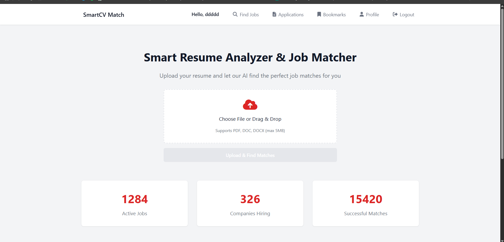
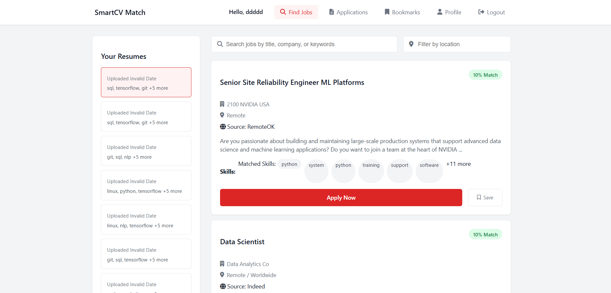
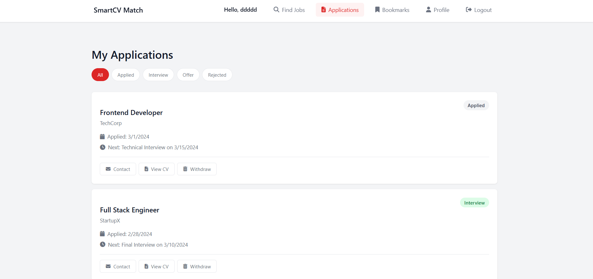

# SmartCVMatch

SmartCVMatch is an intelligent resume matching application that helps job seekers match their resumes with job postings using natural language processing. The application features a Django backend and a modern Svelte frontend.

## Features

- Resume parsing and analysis
- Job matching based on skills and experience
- User authentication and profiles
- Job search functionality
- Bookmark interesting job opportunities
- Application tracking
- Statistics and insights on job matches

##





## Tech Stack

### Backend
- Python/Django
- Django REST Framework
- Natural Language Processing (NLTK)
- SQLite database (local) / PostgreSQL (production)

### Frontend
- Svelte
- TypeScript
- Vite

## Installation

### Prerequisites
- Python 3.7+
- Node.js 14+
- npm or yarn

### Backend Setup
1. Clone the repository
2. Navigate to the backend directory
```
cd smartcvmatch/backend
```
3. Create a virtual environment
```
python -m venv venv
```
4. Activate the virtual environment
```
# Windows
venv\Scripts\activate
# Linux/Mac
source venv/bin/activate
```
5. Install dependencies
```
pip install -r requirements.txt
```
6. Download NLTK data
```
python nltk_download.py
```
7. Run migrations
```
python manage.py migrate
```
8. Start the Django server
```
python manage.py runserver
```

### Frontend Setup
1. Navigate to the frontend directory
```
cd smartcvmatch/frontend
```
2. Install dependencies
```
npm install
```
3. Start the development server
```
npm run dev
```

## Usage

1. Register a new account
2. Upload your resume
3. Browse available jobs
4. View job matches based on your resume
5. Bookmark interesting positions
6. Track your applications

## Project Structure

```
smartcvmatch/
  ├── backend/              # Django backend
  │   ├── core/             # Django project settings
  │   ├── resume_matcher/   # Main application logic
  │   ├── resumes/          # Uploaded resumes
  │   └── manage.py         # Django management script
  │
  └── frontend/             # Svelte frontend
      ├── src/              # Source code
      │   ├── components/   # Svelte components
      │   ├── services/     # API services
      │   └── types/        # TypeScript type definitions
      └── public/           # Static assets
```

## Deployment

### Vercel Deployment (Recommended)
For detailed instructions on deploying to Vercel, see [VERCEL_DEPLOYMENT.md](VERCEL_DEPLOYMENT.md).

Benefits of Vercel deployment:
- No sleep time (always available for recruiters)
- Fast global CDN
- Easy setup and configuration
- Automatic HTTPS

### Alternative Deployment Options
For other deployment options, see [DEPLOYMENT.md](DEPLOYMENT.md).

## License

[MIT License](LICENSE)

## Contributors

Shakawat Hussen Tuhin